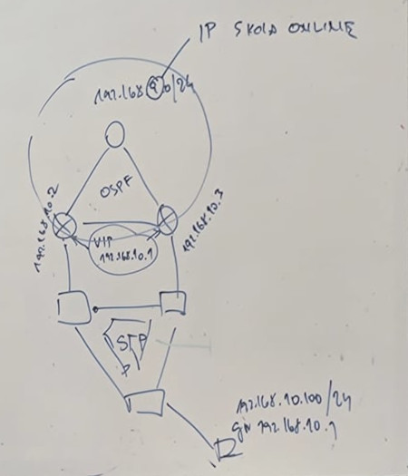
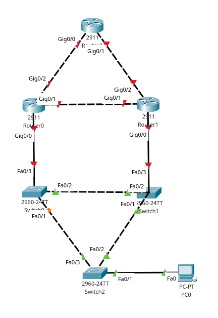
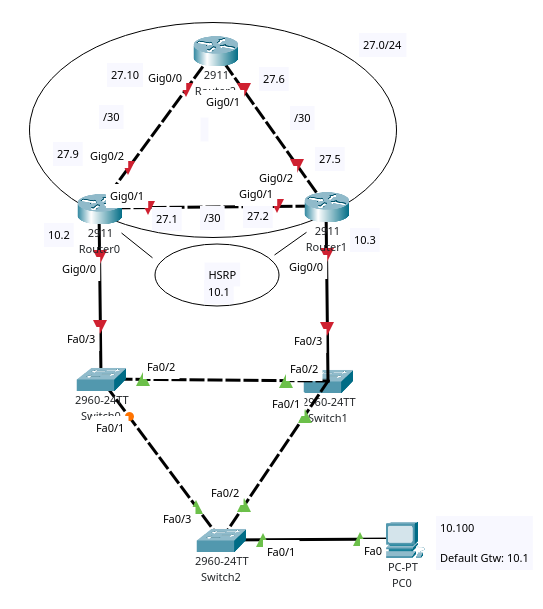
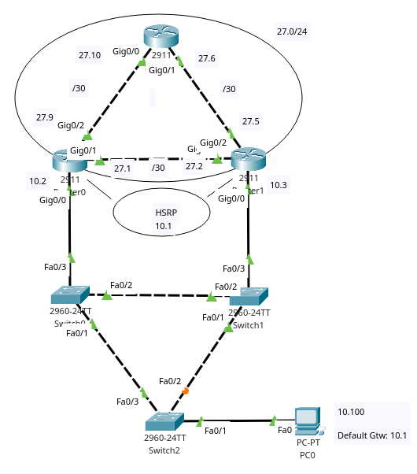

# Networking - STP, OSPF, HSRP

***David Stoček***

## Zadání

## Sestava

Poté po rozložení IP adres, **POZOR, každé 27 nahradte vaším číslem**

## STP - Spanning Tree Protocol

Prvně vybereme PC a nastavíme jeho IP adresu na ***192.168.10.100*** s maskou ***255.255.255.0*** a jeho defaultní branou ***192.168.10.1***

Poté vybereme switch připojený k PC a do interface mezi nimi (pro mě ***Fa0/1***) a napište:

    switchport mode access
    switchport access vlan 1

*Je možné že příkaz nademnou nebude nutný, ale jen tak pro jistotu :)*

Vebereme si dobrovolný switch který se stane primárním STP switchem (pro mě ***Switch0***)a do jeho CLI napíšeme:
    
    spanning-tree vlan 1 root primary

Poté si zvolíme preferovanou trasu, pro nás ***Switch2*** -> ***Switch0***, takže vybereme ***Switch2*** a interface ***Fa0/2*** a napíšeme příkaz:

    spanning-tree vlan 1 cost 2000000

To samé opakujeme pro ***Switch1*** a jeho ***Fa0/1*** interface

## OSPF - Open Shortest Path First

Jako první bude muset nastavit IP adresy pro všechny routery a jejich interfacy pomocí příkazů (Ukážu na routeru ***Router0*** a jeho interfacu ***Gig0/1***):

    ip address 192.168.27.1 255.255.255.252
    no shutdown

Avšak pro interfacy na které patří adresy ***10.2*** a ***10.3*** použijeme masku ***255.255.255.0***

Samotné OSPF nastavíme na každý router pomocí příkazu (Předvedu na routeru ***Router0***): 

    router ospf 1
    network 192.168.27.0 0.0.0.3 area 0
    network 192.168.27.8 0.0.0.3 area 0
    network 192.168.10.0 0.0.0.255 area 0

## HSRP - Hot Standby Router Protocol

Vybereme jeden z routerů které jsou připojeny ke switchi (Předvádím na routeru ***Router0***) a půjdeme na interface připojen k switchi (***Gig0/0***) kde napíšeme:

    standby version 2
    standby 1 ip 192.168.10.1
    standby 1 priority 150
    standby 1 preempt

Poté vybereme ten druhý a jeho interface, poté napíšeme:

    standby version 2
    standby 1 ip 192.168.10.1

## Konec

Nezapomente všude napsat příkaz ***write*** nebo se celej váš progress neuloží

Všechno by nyní mělo fungovat a pokud ne tak to minimálně svítí krásně zeleně, to panu Grussmannovi většinou stačí
